# Methods and Results (draft)

*Working draft assembled from the analyses completed in this repository. Tables are generated from
the results CSVs and traceable to their source files; figures are the rendered outputs in `reports/`.
Prose is descriptive of what was done and what the numbers show. Sentences marked
`[Interpretation:]` are placeholders where the author's interpretation belongs and are not asserted
here. Literature and citations are out of scope for this draft.*

---

## 2. Methods

### 2.1 Study area and interpreted reference

The study area is the western Great Lakes region spanning Wisconsin, Minnesota, and Michigan. The
reference data are interpreted land-cover and change cells produced with the CKIT-RF interpreter
workflow: for each cell an analyst draws training polygons over high-resolution imagery, a per-cell
Random Forest is trained on those labels, and the result is a wall-to-wall classified raster on the
cell footprint (EPSG:5070, 10 m). The interpreted set used here is 180 cells (36 cells in each of
five NAIP acquisition brackets), of which 72 were independently interpreted by more than one
reviewer.

Where a cell was interpreted by more than one reviewer, a single interpretation per cell is selected
by adjudication, recorded in `exports/truth_selections.csv`, so each cell contributes exactly one
reference and none is double counted. The 72 multi-interpreted cells are also retained separately for
the inter-interpreter reliability analysis (Section 2.7), where each is scored as a reviewer pair.

The reference cells fall within the watersheds of seven GLKN park units (Apostle Islands, Grand
Portage, Isle Royale, Mississippi National River and Recreation Area, Saint Croix, Sleeping Bear
Dunes, and Voyageurs); two of the nine GLKN units, Indiana Dunes and Pictured Rocks, fall outside the
study grid extent and are not used. Figure 1 maps the study region, the grid extent, the park units,
and the interpreted cells.

*Figure 1. Study area in the western Great Lakes region (Wisconsin, Minnesota, and the Michigan Upper Peninsula), EPSG:5070, showing the study grid extent, the Great Lakes, the seven GLKN park units, and the 180 interpreted reference cells, with a conterminous-US locator inset, scale bar, and north arrow.*

### 2.2 Class schema and the 5-class collapse

The classification schema has 10 classes: Harvest, Development, Forest, Urban, Water, Agriculture,
Grass/Shrub, Wetland, Beaver, and Insect/Disease. The CKIT interpreter label identifiers are
crosswalked to this schema (0 to Water, 1 to Agriculture, 2 to Grass/Shrub, 3 to Forest, 4 to Urban,
5 to Wetland, 20 to Harvest, 30 to Development, 50 to Insect/Disease, 62 to Beaver). Two reference
values have no 10-class equivalent and are dropped: 10 (Unknown, an abstention) and 13 (Other,
no-change). Fire (40) carries no pixels in this reference set.

For change-focused analysis the schema is collapsed to five classes: Stable (the six no-change
classes pooled), Harvest, Development, Insect/Disease, and Beaver. The primary 5-class collapse
(used for the pooled comparison, the per-cell analyses, and the interpreter agreement) excludes
Unknown and Other. A second per-bracket 5-class product folds Other into Stable instead; the two
collapses are kept distinct and are not interchangeable (see the consistency report).

### 2.3 Prediction sources: embedding variants and the spectral baseline

The embedding predictions are Random Forest classifications of AlphaEarth Foundations embeddings,
run in Google Earth Engine. Five embedding feature configurations are compared, distinguished by how
the base-year and paired-year embeddings and their change are combined (base year 2018, paired year
2020 in the training window, shifting per bracket in the temporally-matched runs):

- v2: base + delta (change from base to paired year).
- v3: base + paired year (both years stacked).
- v4: delta only.
- v5: base + dot product.
- v6: dot product only.

The spectral baseline (spec_all) is a Random Forest trained on 2018/2020 spectral composites drawn
from Sentinel-2, Landsat 8, and Sentinel-1 SAR raw bands and indices (50 bands). All six sources are
classified into the same 10-class schema on the same cell footprints, so the embedding-versus-
spectral comparison is like-for-like on the shared cells.

### 2.4 Temporal transferability design

A single classifier is trained once on the 2018/2020 window and applied to five NAIP brackets:
2017-2019, 2018-2020, 2019-2021, 2020-2022, and 2021-2023. The 2018-2020 bracket is the in-sample
control (its own year window). The five brackets use disjoint 36-cell sets with no cell shared across
brackets, so a bracket-to-bracket difference confounds temporal transfer with the differing cell
composition and landscape difficulty. The per-bracket results are therefore five independent
assessments rather than a controlled transfer curve, and the pooled numbers, or a same-bracket
comparison, are the like-for-like readings. The embedding predictions cover all 180 cells; spec_all
covers 168, since 12 spec_all rasters are entirely nodata in the out-of-sample brackets.

### 2.5 Accuracy assessment

For each source, bracket, and pooling, a confusion matrix is built with the interpreted reference on
rows and the prediction on columns, counting only pixels where both carry a valid class. From each
matrix we report overall accuracy (OA), Cohen's kappa, macro-F1, and mean IoU, and per class the
user's accuracy (UA, precision), producer's accuracy (PA, recall), F1, IoU, and reference support
(pixel count). Because pixels within a cell are spatially autocorrelated, per-class metrics also
carry a design-aware low-support flag that fires when a class appears in fewer than five cells or has
under 100 reference pixels, since a large pixel count concentrated in one or two cells is still only
one or two independent observations.

### 2.6 Inter-interpreter reference reliability

The 72 double-interpreted cells are used to quantify how reliable the reference itself is, per class.
For each reviewer pair a pixel-for-pixel confusion matrix is built on the shared footprint, and per
class the agreement F1 (the balanced probability that the two interpreters concur given one assigned
the class) is computed, both for the 10-class schema and the 5-class collapse. Confidence intervals
use a cluster (pair) bootstrap: the resampling unit is the pair, not the pixel, so within-cell
autocorrelation is respected. Classes are assigned a reliability tier on F1 (High at or above 0.70,
Moderate 0.50 to 0.70, Low below 0.50).

Two supporting diagnostics separate the kinds of disagreement. A spatial-tolerance analysis recomputes
per-class agreement under relaxed neighborhood matching, above a heterogeneity null, to isolate
boundary-misregistration disagreement from conceptual disagreement. A directional-asymmetry analysis
pools the directed reviewer confusion per class and reports an over-assignment index with pair-bootstrap
CIs, to test whether reviewers carry systematic class leanings.

### 2.7 Model accuracy against the reliability ceiling

To place model accuracy against reference reliability, each source's per-class F1 under the 5-class
collapse is computed against the adjudicated reference, pooled over the source's usable cells, with a
cluster (cell) bootstrap. These model F1 values are shown alongside the inter-interpreter agreement
F1 for the same class (the reliability ceiling from Section 2.6), so the gap between a source and the
human ceiling is visible per class.

### 2.8 Per-cell analyses

Beyond pooled metrics, each grid cell is treated as one sample. For every source and cell, the 5-class
confusion is built and the cell's macro-F1 is the mean of the per-class F1 over the classes present in
the reference or the prediction for that cell. A per-class version restricts to each change class and
reports its per-cell F1 distribution. The six sources are compared on the common set of cells usable
for all six (168 cells); each source is also summarized on its own full usable set, which differs in N
and is not a head-to-head ranking.

### 2.9 Spatial-structure diagnostics

Spatial coherence is measured within the interpreted cell footprints, so the reference sets the scale.
Per source we report the mean patch size and the area-weighted median patch size from 8-connected
component labeling, and Moran's I (queen contiguity) of the class raster as a smoothness diagnostic
(class codes are nominal, so this is read as spatial smoothness, not autocorrelation of a meaningful
variable). A complementary neighbor-change metric measures the fraction of horizontally-adjacent,
both-valid pixel pairs whose class differs, over the full rasters.

### 2.10 Training-cap sensitivity

To probe the sensitivity of the rare change classes to training size, a v2 classifier is trained with
the four change classes capped at 50, 100, 150, and 200 training points (stable classes held at 200)
and applied per bracket, pooled over the 180 cells. Per change class we report UA, PA, F1, predicted
pixel count, reference support, and the total unique-training-pixel ceiling, since the cap constrains
the small-pool classes (Beaver about 502 pixels, Insect/Disease about 662) far more than the
large-pool classes (Harvest about 18,800, Development about 8,500).

### 2.11 Software and reproducibility

All analyses are scripted (`scripts/`) and their curated outputs, with rendered figures and per-figure
captions, are in `reports/`. Confusion matrices, metric tables, and figures regenerate from the raw
predictions and the adjudicated reference; the raw prediction and sample sidecars are fetched from
cloud storage and are not committed.

---

## 3. Results

### 3.1 Overall accuracy by prediction source

Pooled over the five brackets, overall accuracy separates the smooth context-preserving embeddings
from the change-only and dot-product configurations (Table 1, Figure 2). Among the embeddings, v2
attains the highest pooled OA (0.659) and v6 the lowest (0.130); the spectral baseline spec_all sits
at 0.588 on its 168-cell pool. Kappa, macro-F1, and mean IoU follow the same ordering.
`[Interpretation: relate the v2/v3/v5 versus v4/v6 split to the context-preserving versus
change-only feature design.]`

| Source | OA | Kappa | Macro-F1 | Mean IoU | N cells | N pixels |
| --- | --- | --- | --- | --- | --- | --- |
| v2 | 0.659 | 0.536 | 0.383 | 0.301 | 180 | 20,404,977 |
| v3 | 0.635 | 0.514 | 0.381 | 0.299 | 180 | 20,404,977 |
| v4 | 0.245 | 0.123 | 0.162 | 0.096 | 180 | 20,404,977 |
| v5 | 0.593 | 0.472 | 0.365 | 0.285 | 180 | 20,404,977 |
| v6 | 0.13 | 0.04 | 0.089 | 0.049 | 180 | 20,404,977 |
| spec_all | 0.588 | 0.461 | 0.362 | 0.275 | 168 | 18,756,059 |

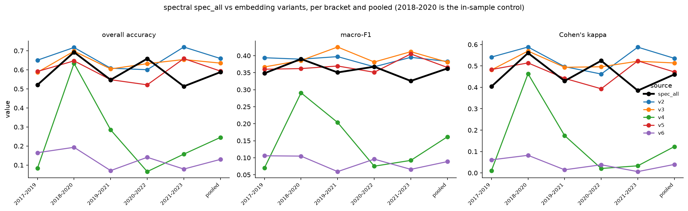

*Figure 2. Overall accuracy, kappa, macro-F1, and mean IoU by prediction source (10-class schema, pooled; embeddings on 180 cells, spec_all on 168).*

### 3.2 Accuracy across temporal brackets

Overall accuracy by source and bracket is shown in Table 2 and Figure 3, with the 2018-2020 in-sample
control marked. The brackets use disjoint cell sets, so these are five independent assessments rather
than a transfer curve. `[Interpretation: comment on which sources hold up off the training window and
which do not, keeping the disjoint-cell caveat in view.]`

| Source | 2017-2019 | 2018-2020 (control) | 2019-2021 | 2020-2022 | 2021-2023 | Pooled |
| --- | --- | --- | --- | --- | --- | --- |
| v2 | 0.651 | 0.717 | 0.608 | 0.601 | 0.72 | 0.659 |
| v3 | 0.587 | 0.698 | 0.605 | 0.632 | 0.654 | 0.635 |
| v4 | 0.084 | 0.634 | 0.285 | 0.066 | 0.158 | 0.245 |
| v5 | 0.591 | 0.647 | 0.548 | 0.521 | 0.659 | 0.593 |
| v6 | 0.165 | 0.193 | 0.071 | 0.141 | 0.079 | 0.13 |
| spec_all | 0.521 | 0.693 | 0.548 | 0.659 | 0.513 | 0.588 |

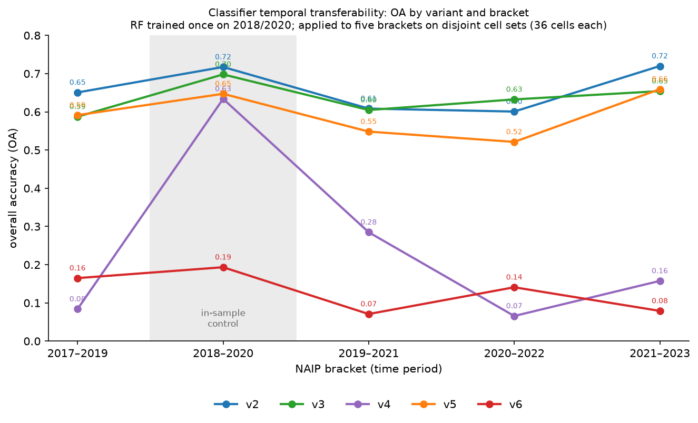

*Figure 3. Overall accuracy per source across the five NAIP brackets (10-class schema, adjudicated reference; 2018-2020 is the in-sample control).*

### 3.3 Per-class accuracy, 10-class schema

Per-class F1, pooled, is given in Table 3, with per-class UA, PA, F1, IoU, and support for every
source in the supplementary long table (Table S1). Reference support is reported per class, and is
low for the rare change classes, so their per-class numbers rest on little data.
`[Interpretation: identify the classes that drive the aggregate differences.]`

| Class | v2 | v3 | v4 | v5 | v6 | spec_all | Support (emb, 180) | Support (spec, 168) |
| --- | --- | --- | --- | --- | --- | --- | --- | --- |
| Harvest | 0.119 | 0.083 | 0.146 | 0.041 | 0.023 | 0.102 | 232,769 | 201,530 |
| Development | 0.018 | 0.007 | 0.005 | 0.006 | 0.004 | 0.007 | 12,596 | 12,421 |
| Forest | 0.793 | 0.767 | 0.351 | 0.718 | 0.188 | 0.77 | 10,569,560 | 9,491,431 |
| Urban | 0.466 | 0.497 | 0.052 | 0.481 | 0.041 | 0.453 | 661,146 | 628,665 |
| Water | 0.938 | 0.938 | 0.3 | 0.933 | 0.15 | 0.94 | 1,725,908 | 1,490,487 |
| Agriculture | 0.8 | 0.806 | 0.477 | 0.797 | 0.265 | 0.62 | 3,110,297 | 3,086,878 |
| Grass/Shrub | 0.246 | 0.28 | 0.168 | 0.256 | 0.099 | 0.332 | 1,768,935 | 1,685,451 |
| Wetland | 0.431 | 0.409 | 0.097 | 0.405 | 0.109 | 0.373 | 2,247,007 | 2,086,285 |
| Beaver | 0.004 | 0.003 | 0.012 | 0.003 | 0.001 | 0.004 | 8,021 | 7,922 |
| Insect/Disease | 0.016 | 0.017 | 0.008 | 0.012 | 0.006 | 0.023 | 68,738 | 64,989 |

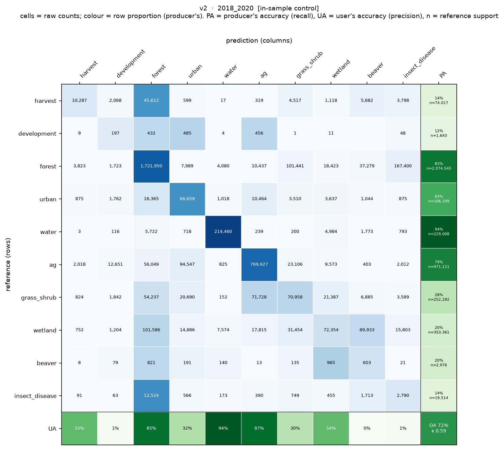

*Figure 5a. Per-class confusion for v2, in-sample control bracket 2018-2020 (10-class, 36 cells; raw counts colored by row proportion, PA column and UA row, OA and kappa in the corner). See the consistency report on the per-bracket versus pooled basis.*

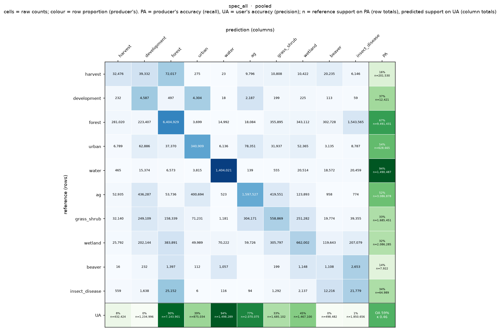

*Figure 5b. Per-class confusion for spec_all, pooled (10-class, 168 cells).*

### 3.4 Change-focused accuracy under the 5-class collapse

Under the 5-class collapse on the common 168-cell set, overall accuracy is high for every source
because the landscape is stable-dominated (the all-Stable baseline OA is 0.985), so kappa and
macro-F1 carry the change signal (Table 4, Figure 4). The pooled 5-class OA is highest for v4 (0.897)
and lowest for v6 (0.602). `[Interpretation: contrast the 5-class OA ordering with the 10-class
ordering in Table 1, noting the role of the stable-dominated baseline and of v4's behavior when the
change classes are folded.]`

| Source | OA | All-Stable baseline OA | Kappa | Macro-F1 | Mean IoU | N cells |
| --- | --- | --- | --- | --- | --- | --- |
| v2 | 0.875 | 0.985 | 0.039 | 0.22 | 0.193 | 168 |
| v3 | 0.833 | 0.985 | 0.02 | 0.201 | 0.177 | 168 |
| v4 | 0.897 | 0.985 | 0.071 | 0.223 | 0.198 | 168 |
| v5 | 0.799 | 0.985 | 0.012 | 0.191 | 0.167 | 168 |
| v6 | 0.602 | 0.985 | 0.004 | 0.157 | 0.124 | 168 |
| spec_all | 0.782 | 0.985 | 0.031 | 0.203 | 0.171 | 168 |

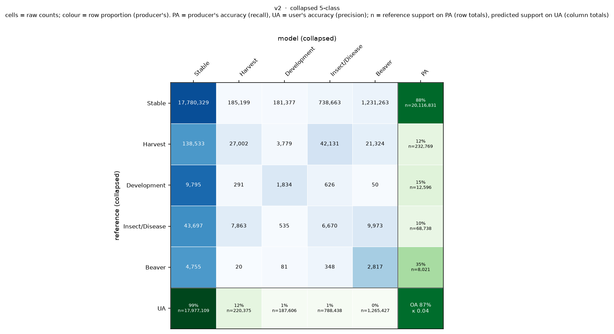

*Figure 4a. Pooled 5-class confusion for v2 (180 cells).*

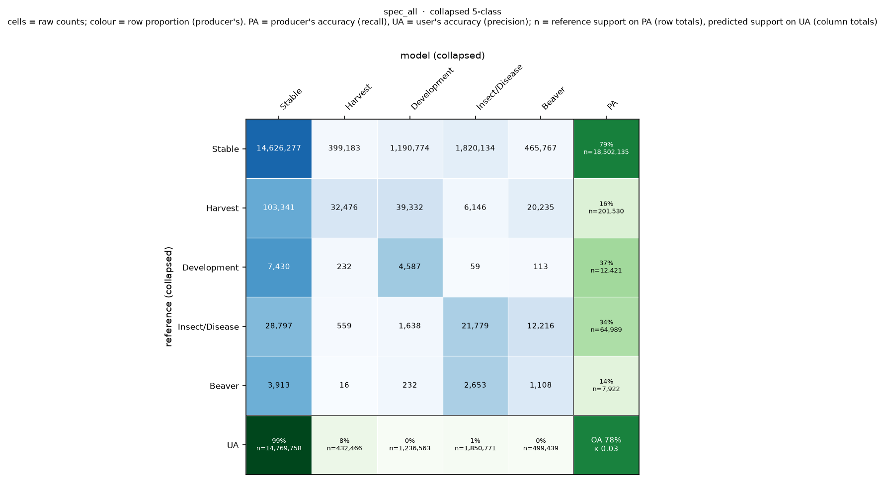

*Figure 4b. Pooled 5-class confusion for spec_all (168 cells).*

### 3.5 Reliability of the interpreted reference

Inter-interpreter agreement over the 72 double-interpreted cells sets a per-class reliability ceiling
(Tables 5 and 6, Figures 6 and 7). Mean per-pair overall agreement is 0.77 (kappa 0.60). In the
5-class collapse, interpreters agree almost perfectly on Stable (F1 0.993) and well on Harvest (0.749),
and fall to Low reliability on Development (0.295), Insect/Disease (0.229), and Beaver (0.077). In the
10-class schema, Water, Forest, and Agriculture are High reliability while Grass/Shrub and Wetland are
Low. `[Interpretation: state the consequence for model evaluation on the Low-reliability classes.]`

| Class | N Pairs | Support (px) | F1 | F1 95% CI | IoU | IoU 95% CI | Reliability |
| --- | --- | --- | --- | --- | --- | --- | --- |
| Stable | 72 | 8,058,860 | 0.993 | 0.99-0.996 | 0.986 | 0.981-0.991 | High |
| Harvest | 34 | 124,240 | 0.749 | 0.631-0.822 | 0.599 | 0.461-0.698 | High |
| Development | 26 | 9,155 | 0.295 | 0.027-0.48 | 0.173 | 0.014-0.315 | Low |
| Insect/Disease | 19 | 56,257 | 0.229 | 0.004-0.466 | 0.129 | 0.002-0.303 | Low |
| Beaver | 15 | 8,828 | 0.077 | 0.0-0.209 | 0.04 | 0.0-0.117 | Low |

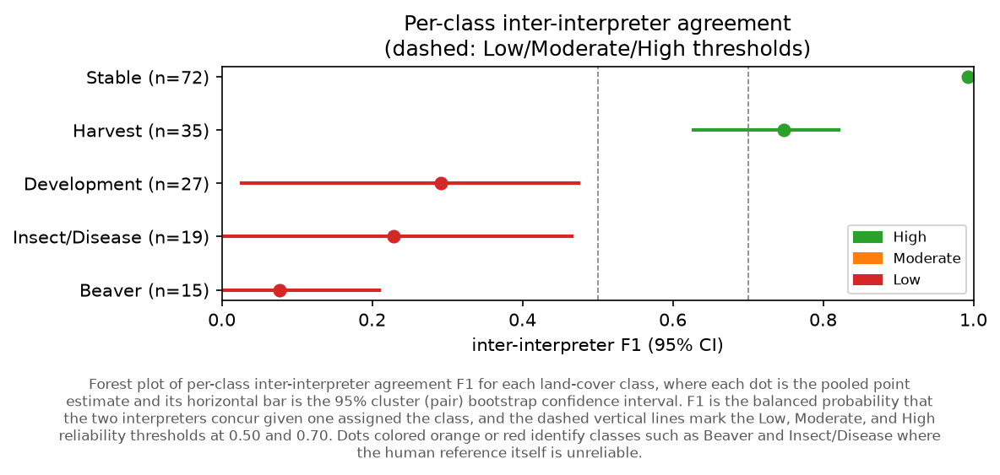

*Figure 7. Inter-interpreter per-class agreement F1 with 95% cluster (pair) bootstrap CIs, 5-class collapse, 72 pairs.*

The full 10-class agreement table (Table 5) and its forest plot (Figure 6) are reported in the
supplement-adjacent material; the pooled interpreter confusion matrix is Figure S1.

### 3.6 Model accuracy against the reliability ceiling

Placing each source's per-class 5-class F1 next to the inter-interpreter ceiling shows the two
regimes per class (Table 7, Figure 8). On Stable the sources approach the ceiling (v4 0.947 versus
0.993). On Harvest the best source reaches 0.146 (v4) against a ceiling of 0.749, a large gap. On
Development, Insect/Disease, and Beaver both the sources and the ceiling are low.
`[Interpretation: distinguish the reducible gap on Harvest from the reference-limited classes.]`

| Class | v2 | v3 | v4 | v5 | v6 | spec_all | Interpreter ceiling |
| --- | --- | --- | --- | --- | --- | --- | --- |
| Stable | 0.933 | 0.907 | 0.947 | 0.886 | 0.749 | 0.879 | 0.993 |
| Harvest | 0.119 | 0.083 | 0.146 | 0.041 | 0.023 | 0.102 | 0.749 |
| Development | 0.018 | 0.007 | 0.005 | 0.006 | 0.004 | 0.007 | 0.295 |
| Insect/Disease | 0.016 | 0.017 | 0.008 | 0.012 | 0.006 | 0.023 | 0.229 |
| Beaver | 0.004 | 0.003 | 0.012 | 0.003 | 0.001 | 0.004 | 0.077 |

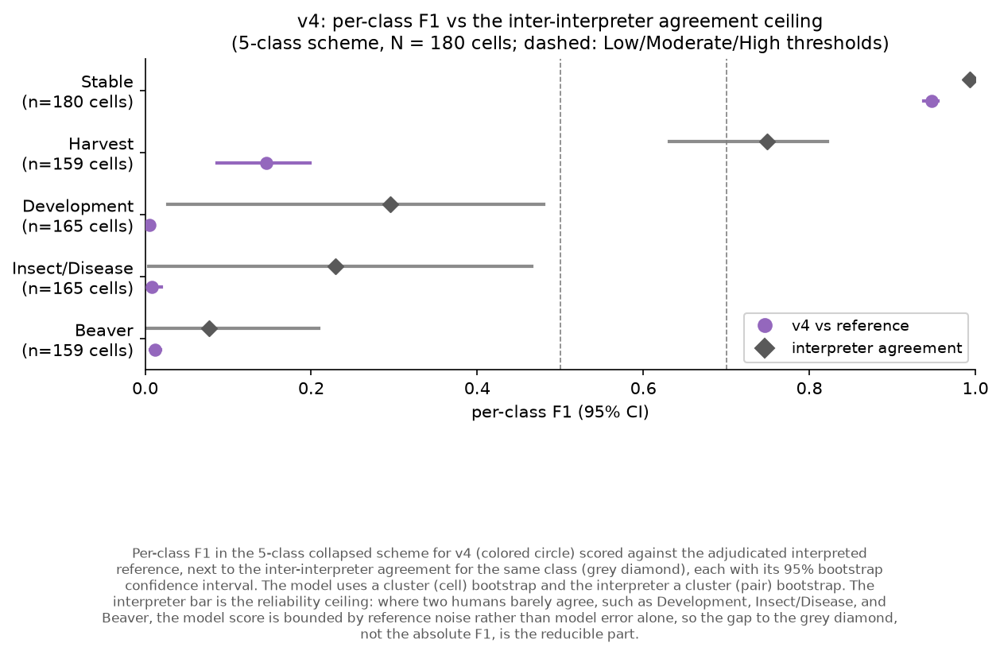

*Figure 8. Per-class F1 for v4 (colored) against the inter-interpreter ceiling (grey), 5-class collapse, with 95% bootstrap CIs. One panel per source in reports/model_vs_interpreter_5class/.*

### 3.7 Per-cell distributions

The per-cell macro-F1 distributions (Table 10, Figure 11) and the per-class change-class F1
distributions (Table 11, Figure 12) summarize how each source does cell by cell rather than in the
pool. `[Interpretation: note where a distribution spikes at zero for a change class and what that
indicates about commission or omission.]`

| Source | N (common) | Mean F1 (common) | Median F1 (common) | N (full) | Mean F1 (full) | Median F1 (full) |
| --- | --- | --- | --- | --- | --- | --- |
| v2 | 168 | 0.278 | 0.246 | 180 | 0.277 | 0.247 |
| v3 | 168 | 0.275 | 0.25 | 180 | 0.273 | 0.249 |
| v4 | 168 | 0.236 | 0.21 | 180 | 0.24 | 0.21 |
| v5 | 168 | 0.244 | 0.228 | 180 | 0.24 | 0.225 |
| v6 | 168 | 0.155 | 0.152 | 180 | 0.154 | 0.151 |
| spec_all | 168 | 0.207 | 0.19 | 168 | 0.207 | 0.19 |

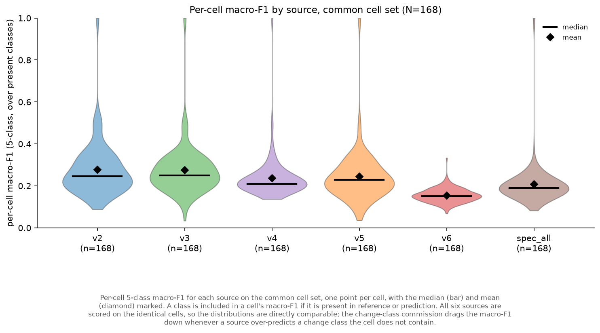

*Figure 11. Per-cell 5-class macro-F1 by source on the common 168-cell set, median (bar) and mean (diamond) marked.*

| Change class | v2 | v3 | v4 | v5 | v6 | spec_all |
| --- | --- | --- | --- | --- | --- | --- |
| Harvest | 0.068 | 0.034 | 0.062 | 0.012 | 0.016 | 0.048 |
| Development | 0.025 | 0.003 | 0.022 | 0.002 | 0.006 | 0.013 |
| Insect/Disease | 0.008 | 0.009 | 0.006 | 0.006 | 0.005 | 0.011 |
| Beaver | 0.007 | 0.006 | 0.015 | 0.004 | 0.002 | 0.007 |

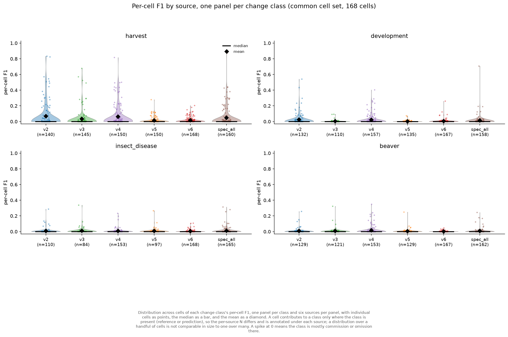

*Figure 12. Per-cell F1 for the four change classes by source (5-class collapse, common set; contributing cell counts annotated).*

### 3.8 Spatial structure and speckle

The spatial-structure diagnostics (Table 9, Figure 9) and the neighbor-change speckle metric (Table
S3, Figure 10) characterize the maps' spatial coherence. The interpreted reference has a mean patch
size of 0.79 ha and Moran's I 0.75; among the sources, v6 is the outlier (mean patch 0.02 ha, Moran's
I 0.08, neighbor-change 0.781), consistent with its per-pixel dot-product format, while v2, v3, and
v5 cluster near the reference scale. `[Interpretation: connect the spatial-structure ordering to the
accuracy ordering and to the point that similar aggregate accuracy can hide different spatial
predictions.]`

| Source | N patches | Mean patch (ha) | Median-by-area (ha) | Moran's I (mean) | Moran's I (std) |
| --- | --- | --- | --- | --- | --- |
| interpreted (ref) | 258,077 | 0.79 | 238.87 | 0.75 | 0.097 |
| v2 | 186,504 | 1.1 | 110.38 | 0.82 | 0.048 |
| v3 | 167,631 | 1.22 | 93.97 | 0.82 | 0.043 |
| v4 | 553,745 | 0.37 | 290.65 | 0.67 | 0.098 |
| v5 | 205,109 | 1 | 77 | 0.82 | 0.046 |
| v6 | 9,502,626 | 0.02 | 0.03 | 0.08 | 0.045 |
| spec_all | 337,808 | 0.56 | 47.02 | 0.73 | 0.071 |

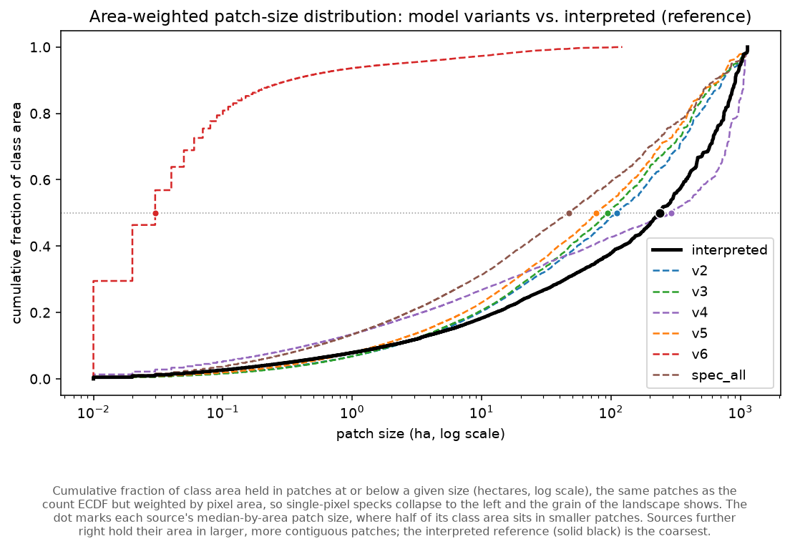

*Figure 9a. Area-weighted patch-size ECDF by source (within interpreted footprints).*

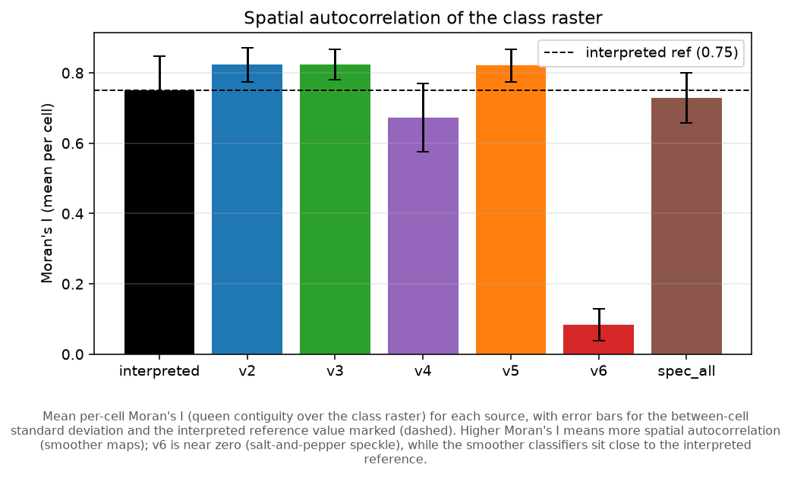

*Figure 9b. Moran's I by source.*

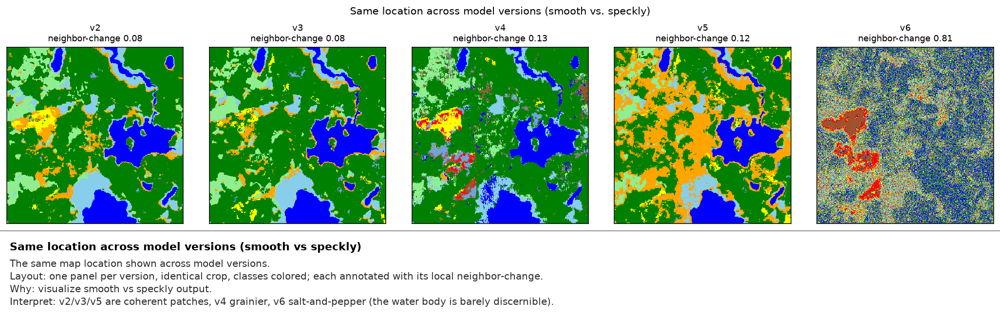

*Figure 10. Cropped classified-map detail per embedding variant illustrating the neighbor-change speckle metric.*

### 3.9 Training-cap sensitivity for the change classes

Table 8 and Figure 13 report how the change-class metrics move as the training cap varies from 50 to
200 points, with the training ceiling per class given so the cap is read relative to the available
pool. `[Interpretation: state, for Beaver and Insect/Disease especially, whether lower caps trade
commission for recall or simply relabel, per the interpretive guardrail in the analysis note.]`

| Change class | Training cap | Training ceiling (px) | UA (precision) | PA (recall) | F1 | Support (px) | Predicted (px) |
| --- | --- | --- | --- | --- | --- | --- | --- |
| Beaver | 50 | 502 | 0.005 | 0.236 | 0.009 | 8,021 | 417,661 |
| Beaver | 100 | 502 | 0.003 | 0.301 | 0.005 | 8,021 | 963,501 |
| Beaver | 150 | 502 | 0.002 | 0.362 | 0.004 | 8,021 | 1,372,227 |
| Beaver | 200 | 502 | 0.002 | 0.351 | 0.004 | 8,021 | 1,264,957 |
| Development | 50 | 8,482 | 0.005 | 0.057 | 0.01 | 12,596 | 131,906 |
| Development | 100 | 8,482 | 0.006 | 0.171 | 0.012 | 12,596 | 340,212 |
| Development | 150 | 8,482 | 0.005 | 0.214 | 0.009 | 12,596 | 584,544 |
| Development | 200 | 8,482 | 0.01 | 0.146 | 0.018 | 12,596 | 187,381 |
| Harvest | 50 | 18,807 | 0.487 | 0.501 | 0.494 | 232,769 | 239,688 |
| Harvest | 100 | 18,807 | 0.292 | 0.646 | 0.402 | 232,769 | 515,011 |
| Harvest | 150 | 18,807 | 0.249 | 0.67 | 0.364 | 232,769 | 625,679 |
| Harvest | 200 | 18,807 | 0.123 | 0.116 | 0.119 | 232,769 | 220,320 |
| Insect/Disease | 50 | 662 | 0.008 | 0.08 | 0.015 | 68,738 | 672,730 |
| Insect/Disease | 100 | 662 | 0.008 | 0.083 | 0.014 | 68,738 | 720,331 |
| Insect/Disease | 150 | 662 | 0.007 | 0.085 | 0.013 | 68,738 | 795,788 |
| Insect/Disease | 200 | 662 | 0.008 | 0.097 | 0.016 | 68,738 | 787,829 |

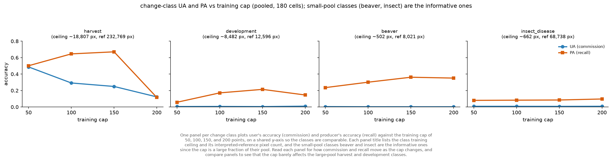

*Figure 13. User's and producer's accuracy for the four change classes versus the training cap (v2, 10-class, 180 cells).*

### 3.10 Robustness

The choice of which reviewer represents a multi-interpreted cell was tested by repeating the
pick-one-per-location draw 100 times on the earlier snapshot; the version ordering is stable (Table
S2). Map speckle by variant is reported in Table S3.

| version | metric | mean | std | min | max | p2_5 | p97_5 | range |
| --- | --- | --- | --- | --- | --- | --- | --- | --- |
| v2 | overall_accuracy | 0.657 | 0.0019 | 0.6517 | 0.6614 | 0.6535 | 0.6606 | 0.0097 |
| v2 | macro_f1 | 0.3793 | 0.0018 | 0.3752 | 0.3835 | 0.3758 | 0.3826 | 0.0083 |
| v2 | mean_iou | 0.2979 | 0.0016 | 0.2943 | 0.302 | 0.2952 | 0.3011 | 0.0077 |
| v2 | kappa | 0.5303 | 0.0026 | 0.5232 | 0.5363 | 0.5255 | 0.535 | 0.0131 |
| v3 | overall_accuracy | 0.6062 | 0.0017 | 0.6017 | 0.6101 | 0.6029 | 0.6093 | 0.0084 |
| v3 | macro_f1 | 0.3724 | 0.0018 | 0.3685 | 0.3764 | 0.3693 | 0.3759 | 0.0078 |
| v3 | mean_iou | 0.2907 | 0.0016 | 0.2873 | 0.2944 | 0.2882 | 0.2939 | 0.0071 |
| v3 | kappa | 0.4833 | 0.0023 | 0.4776 | 0.4885 | 0.4793 | 0.4873 | 0.0109 |
| v4 | overall_accuracy | 0.5071 | 0.0018 | 0.5025 | 0.5117 | 0.5033 | 0.5104 | 0.0091 |
| v4 | macro_f1 | 0.2431 | 0.0016 | 0.2398 | 0.2468 | 0.2402 | 0.2458 | 0.007 |
| v4 | mean_iou | 0.1632 | 0.0011 | 0.161 | 0.1658 | 0.1612 | 0.1651 | 0.0048 |
| v4 | kappa | 0.3186 | 0.0023 | 0.3132 | 0.3237 | 0.314 | 0.3225 | 0.0105 |
| v5 | overall_accuracy | 0.5643 | 0.0017 | 0.5602 | 0.5683 | 0.5611 | 0.5671 | 0.0081 |
| v5 | macro_f1 | 0.361 | 0.0017 | 0.357 | 0.3648 | 0.358 | 0.3643 | 0.0077 |
| v5 | mean_iou | 0.2793 | 0.0015 | 0.2758 | 0.283 | 0.2769 | 0.2823 | 0.0072 |
| v5 | kappa | 0.4418 | 0.0023 | 0.4367 | 0.447 | 0.4379 | 0.4454 | 0.0103 |
| v6 | overall_accuracy | 0.1864 | 0.0004 | 0.1853 | 0.1874 | 0.1856 | 0.1873 | 0.0021 |
| v6 | macro_f1 | 0.1036 | 0.0004 | 0.1027 | 0.1044 | 0.1028 | 0.1043 | 0.0017 |
| v6 | mean_iou | 0.0582 | 0.0002 | 0.0577 | 0.0587 | 0.0578 | 0.0586 | 0.001 |
| v6 | kappa | 0.0591 | 0.0005 | 0.0574 | 0.0604 | 0.0582 | 0.06 | 0.0029 |

---

*End of draft. Sections marked `[Interpretation:]` and the missing study-area figure (Figure 1) are
left for the author. See `manuscript_tables_figures_plan.md` for the full candidate set and
`consistency_report.md` for the basis caveats that any combined statement must respect.*
