# Presentation Figures

Compiled PNGs from `presentation/figures/`. Alternate versions of a figure are shown together as
options. Supplemental figures are grouped at the end. (Excludes `marker_style_options/`.)

## Main figures

### Figure 01 — Change agents on NAIP
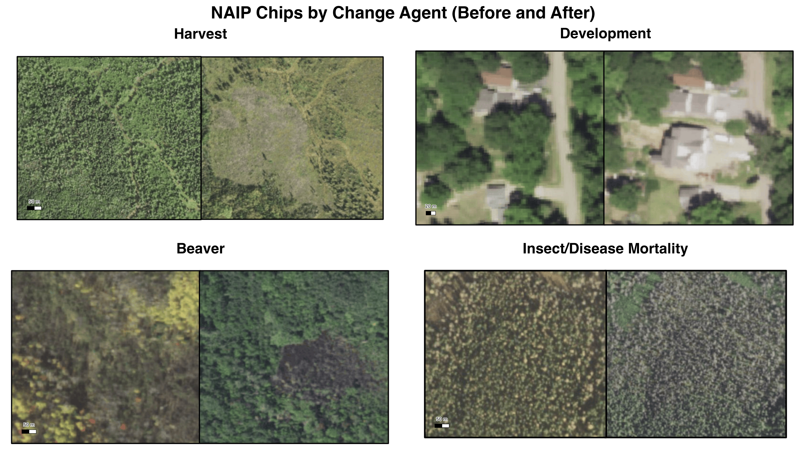

2x2 before/after NAIP chips: Harvest, Development, Beaver, Insect/Disease Mortality.

### Figure 02 — Rarity of change

Primary (reference-pixel composition, 180-cell basis):

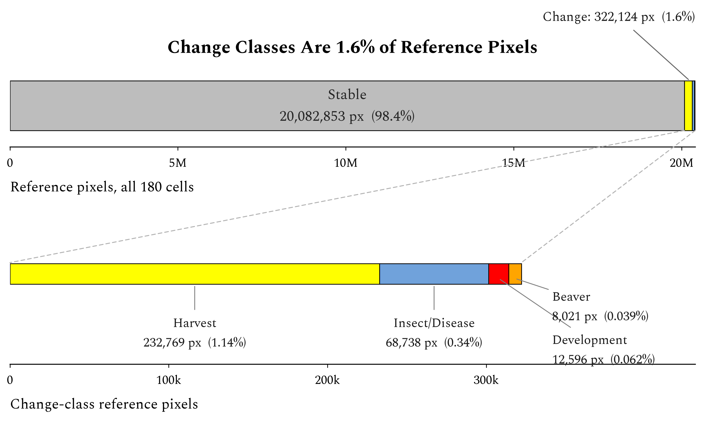

Companion — total change-polygon area by agent (two spans, pick one):

Option A, 2010-2020 (full):

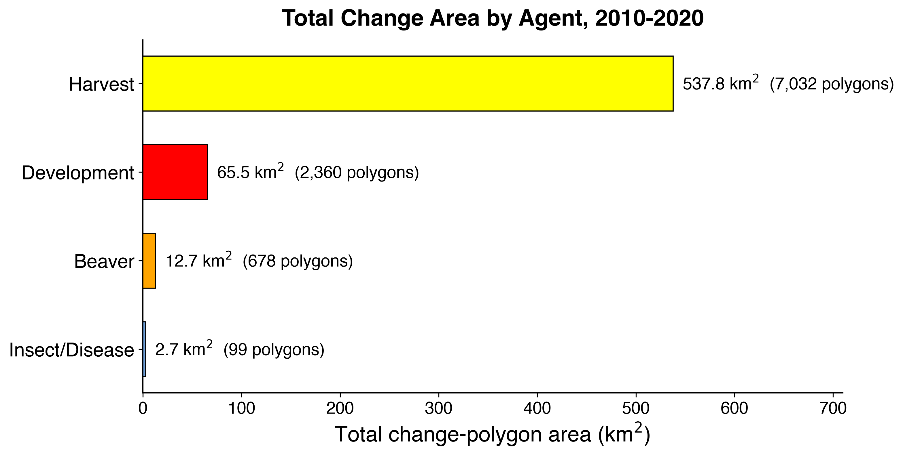

Option B, 2018-2020 (aligned with the classification window):

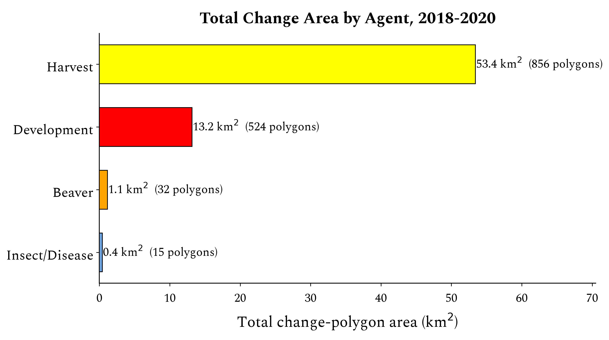

### Figure 03 — AlphaEarth schematic (two options)

Option A, inputs vs training targets:

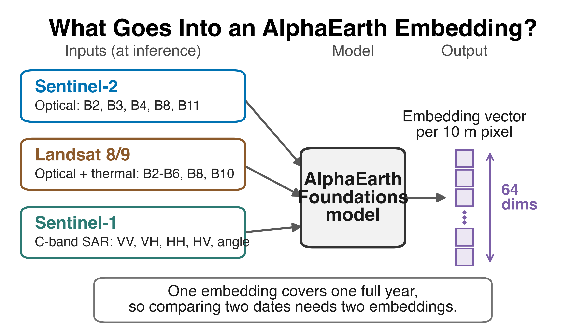

Option B, what goes into an embedding (previous version):

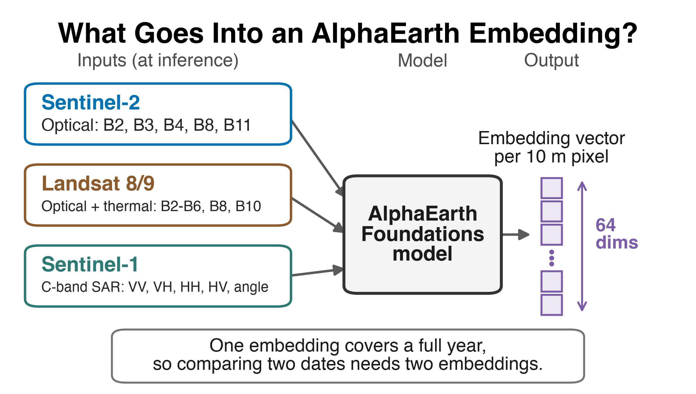

### Figure 04 — CKIT-RF interface and interpreted reference
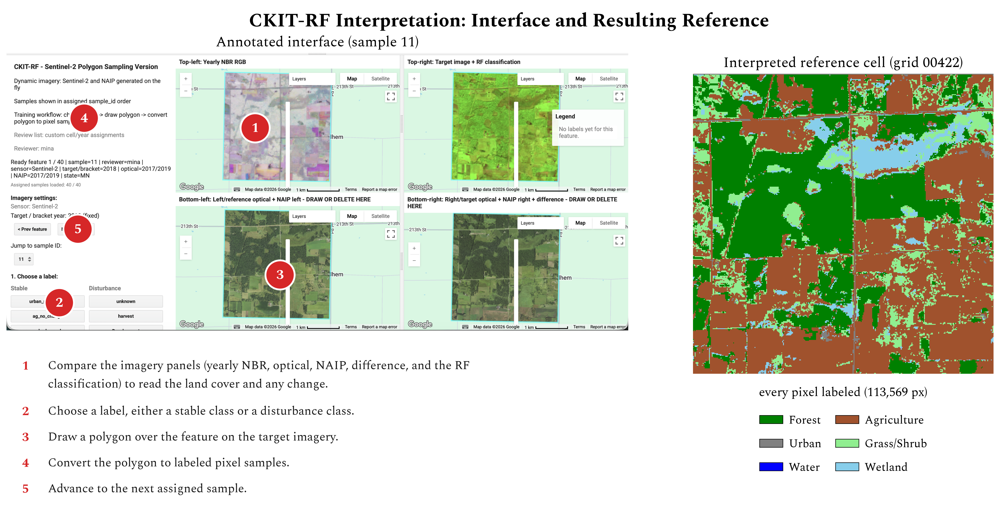

### Figure 05 — Census versus 50 sample points
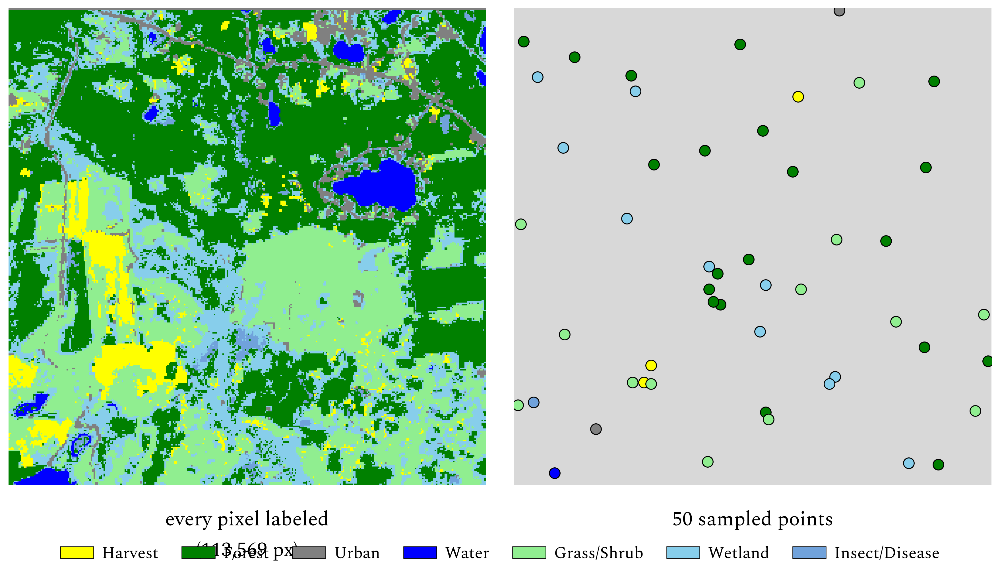

### Figure 06 — Map speckle versus overall accuracy (two options)

Option A, 10-class pooled OA:

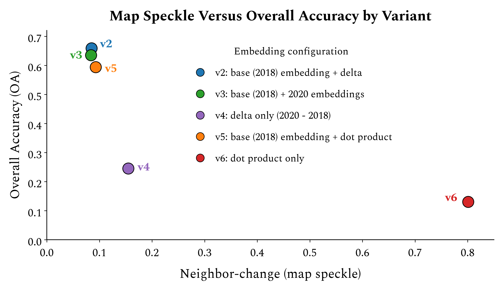

Option B, design-based 5-class OA:

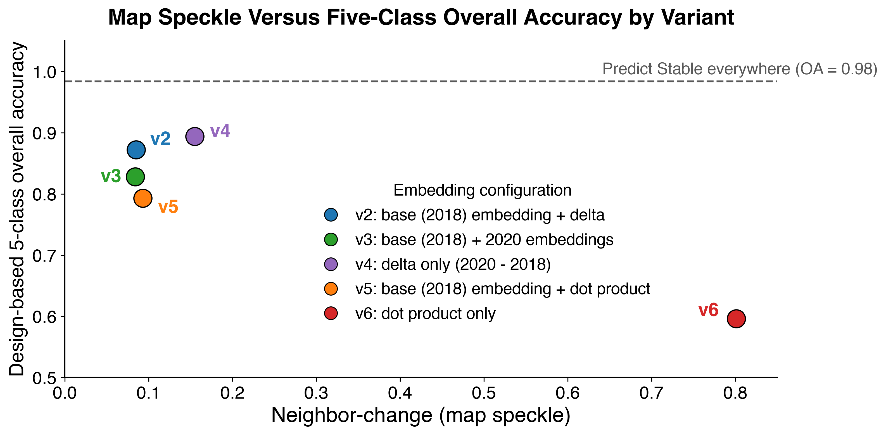

### Figure 14 — Five-class change F1 across sources (primary results)

Per-class F1 for the four change classes, all six sources on the common 168-cell set. No per-class
winner arrows: brackets use disjoint cell sets, so a pooled cross-source ranking is not valid. The only
annotation is the ceiling (best F1 anywhere = 0.14, v4 Harvest).

Version A, y auto-zoomed just above the tallest bar (axis max labelled so the scale is not misread):

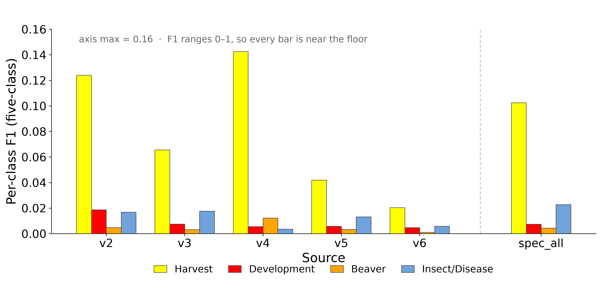

Version B, full 0–1 scale (drives the "everything is at the floor" message):

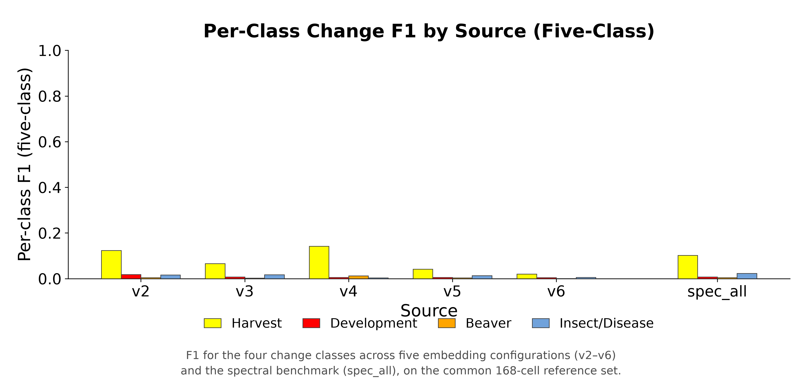

Backup — faceted per bracket (evidence that failure is uniform in every bracket and the source ranking
is not stable):

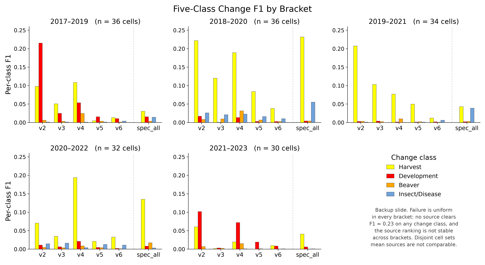

### Figure 15 — Two operations on a pair of embeddings

Dimensionality teaching figure. Two embeddings (2018, 2020) drawn as stacks of band layers
(A00, A01, A02, ⋮, A63); Delta (elementwise difference) preserves all 64 dimensions as a 64-cell
strip, the dot product collapses the pair to a single cell, drawn at the same cell scale so the
64-vs-1 gap is visible at a glance. Fills are illustrative, not real values. Dot product is a cosine
similarity in [−1, 1] (embeddings are unit-norm per the AlphaEarth paper, Fig 1E).

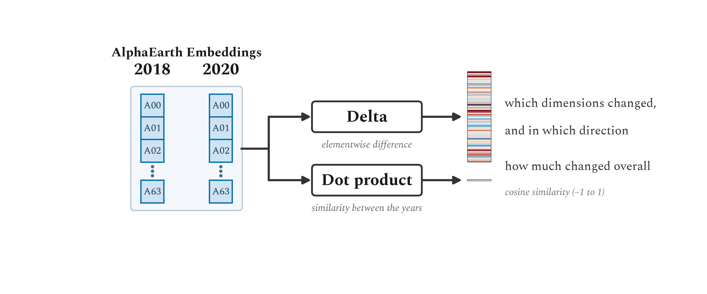

### Figure 16 — How the spectral composite baseline is built

Linear pipeline: three sensors, each a distinct color and showing its bands by type (Sentinel-2
Blue/Green/Red/NIR/SWIR; Landsat 8/9 adds Pan and Thermal; Sentinel-1 VV/VH/HH/HV/angle), feed one
spectral composite (50 bands with indices, growing season April to October), classified by a Random
Forest (300 trees) into a land-cover map. The growing-season window is user-supplied (not in the repo).

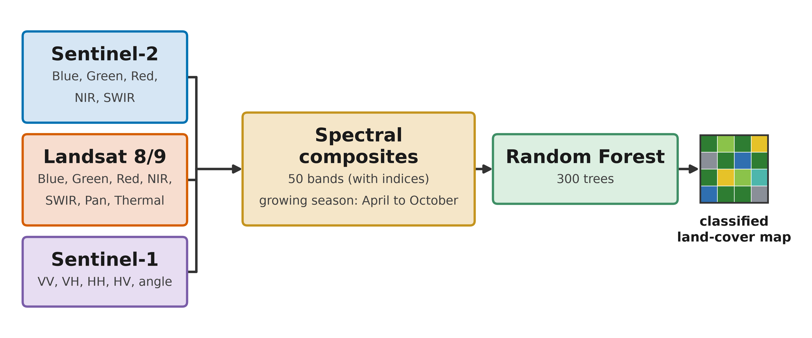

## Supplemental figures

### Supplemental — Tasseled Cap class-centroid trajectory
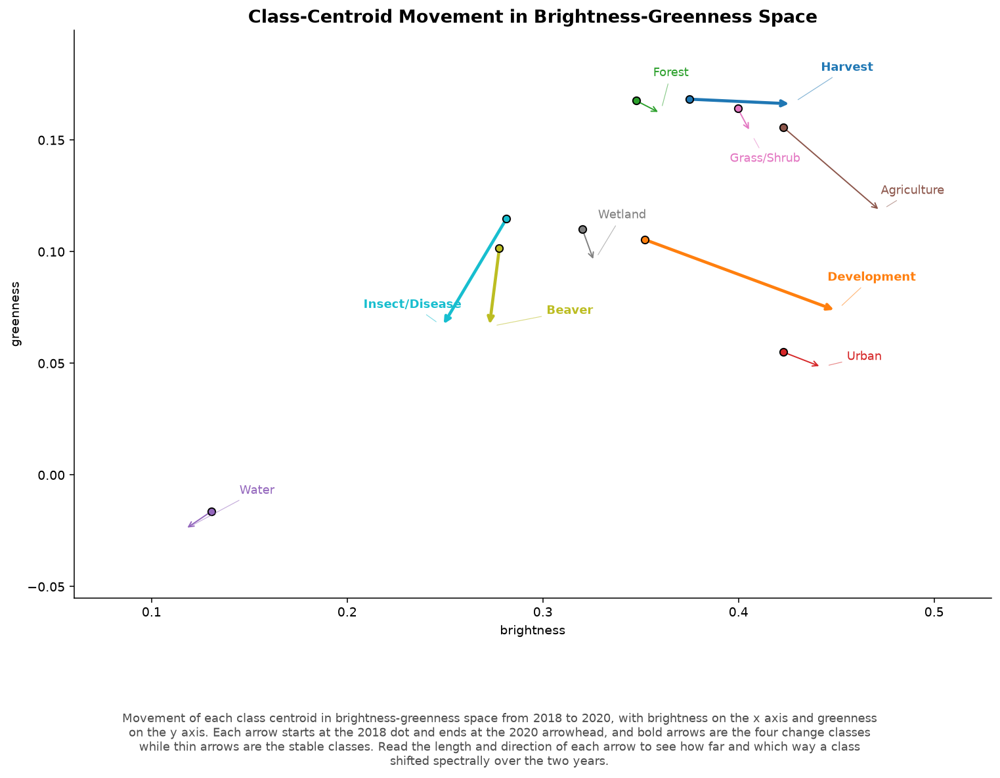

### Supplemental — Variant composition (embeddings + spectral), two options

Option A, compressed y-axis (clipped):

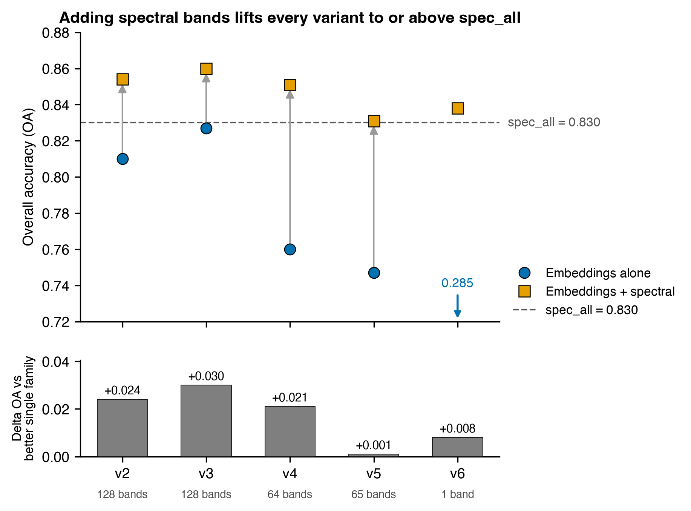

Option B, full continuous y-axis:

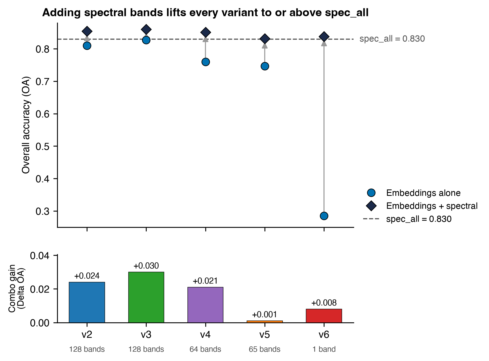
