# Presentation Figures

Compiled PNGs from `presentation/figures/`. Alternate versions of a figure are shown together as
options. Supplemental figures are grouped at the end. (Excludes `marker_style_options/`.)

## Main figures

### Figure 01 — Change agents on NAIP

2x2 before/after NAIP examples: Harvest, Development, Beaver, Insect/Disease Mortality.

### Figure 02 — Rarity of change

Primary (reference-pixel composition, 180-cell basis):

Companion — total change-polygon area by agent (two spans, pick one):

Option A, 2010-2020 (full):

Option B, 2018-2020 (aligned with the classification window):

Companion — rarity on an area basis, with the seven GLKN park watersheds (21,645 km²) as the universe.
Attributed change polygons (2010-2020) cover 619 km² = 2.9% of the watersheds; Panel B zooms the change
sliver by type (Harvest 2.48%, Development 0.30%, Beaver 0.059%, Insect/Disease 0.013% of watershed area):

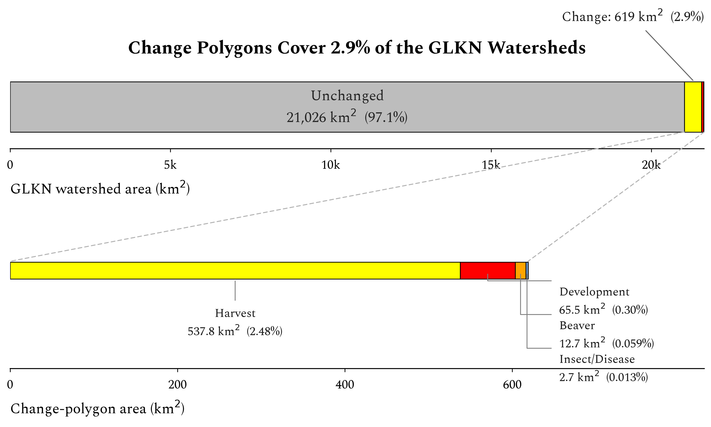

### Figure 03 — AlphaEarth schematic (two options)

Option A, inputs vs training targets:

Option B, what goes into an embedding (previous version):

Option C, restyled (pres_16 flat style): shaded input boxes, simplified training-targets step
(Climate/LiDAR/Land cover/Text, training only), and the embedding drawn as a stack of layers:

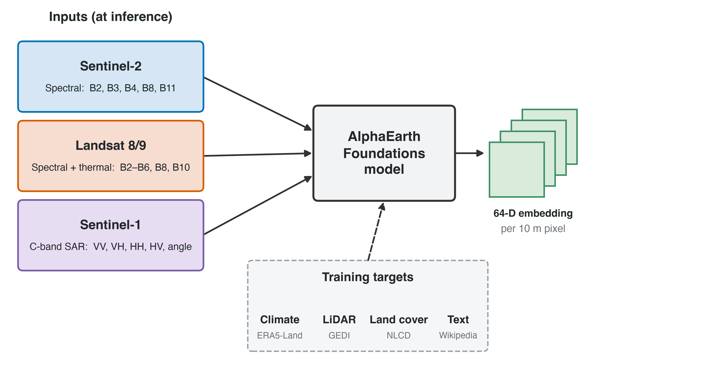

### Figure 04 — CKIT-RF interface and interpreted reference

### Figure 05 — Census versus 50 sample points

### Figure 06 — Map speckle versus overall accuracy (two options)

Option A, 10-class pooled OA:

Option B, design-based 5-class OA:

### Figure 11 — Four-stage workflow (colored)

Reference, Features (the single fork: two-date AlphaEarth embeddings and the Spectral composite),
Classification, Evaluation. Colored-box variant:

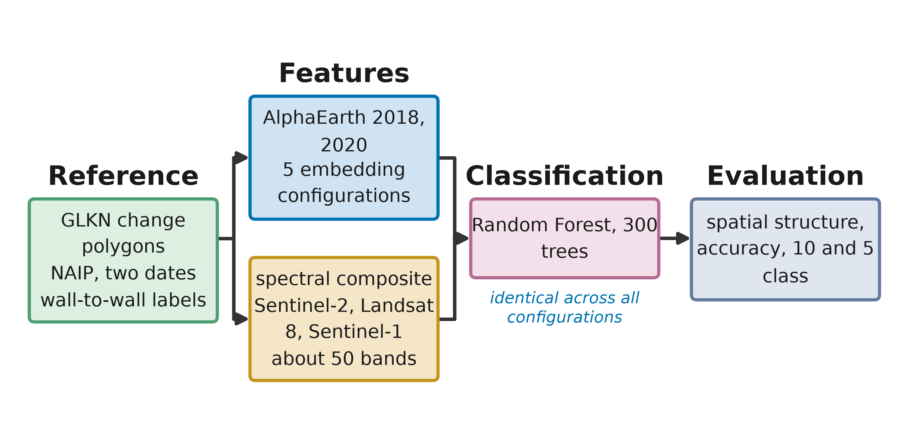

Version 2 — the classified land-cover map is its own box in the pipeline (Random Forest -> Land-Cover
Map -> Evaluation; illustrative pixels, like pres_16). Reference trimmed to two lines, and the Features
labels updated (two-date AlphaEarth; "Spectral composite" over "Sentinel-2, Landsat 8, Sentinel-1,
bands + indices"):

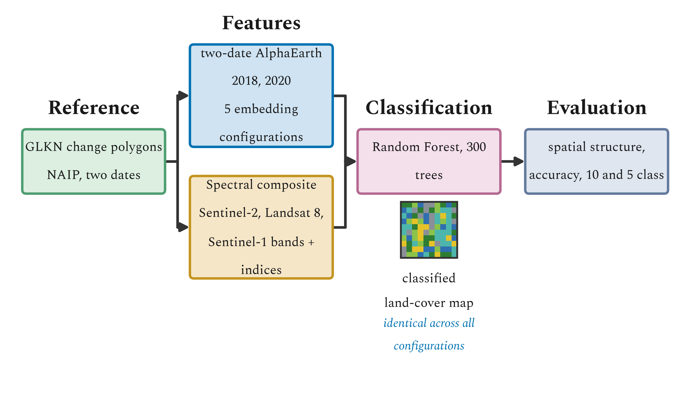

### Figure 14 — Five-class change F1 across sources (primary results)

Per-class F1 for the four change classes, all six sources on the common 168-cell set. No per-class
winner arrows: brackets use disjoint cell sets, so a pooled cross-source ranking is not valid. The only
annotation is the ceiling (best F1 anywhere = 0.14, v4 Harvest).

Version A, y auto-zoomed just above the tallest bar (axis max labelled so the scale is not misread):

Version B, full 0–1 scale (drives the "everything is at the floor" message):

Backup — faceted per bracket (evidence that failure is uniform in every bracket and the source ranking
is not stable):

### Figure 15 — Two operations on a pair of embeddings

Dimensionality teaching figure. Two embeddings (2018, 2020) drawn as stacks of band layers
(A00, A01, A02, ⋮, A63); Delta (elementwise difference) preserves all 64 dimensions as a 64-cell
strip, the dot product collapses the pair to a single cell, drawn at the same cell scale so the
64-vs-1 gap is visible at a glance. Fills are illustrative, not real values. Dot product is a cosine
similarity in [−1, 1] (embeddings are unit-norm per the AlphaEarth paper, Fig 1E).

Version 2 — same flow with the actual AlphaEarth maps (2019 and 2020 embeddings, the delta, and the dot
product) from `presentation/assets/`, instead of the schematic drawings:

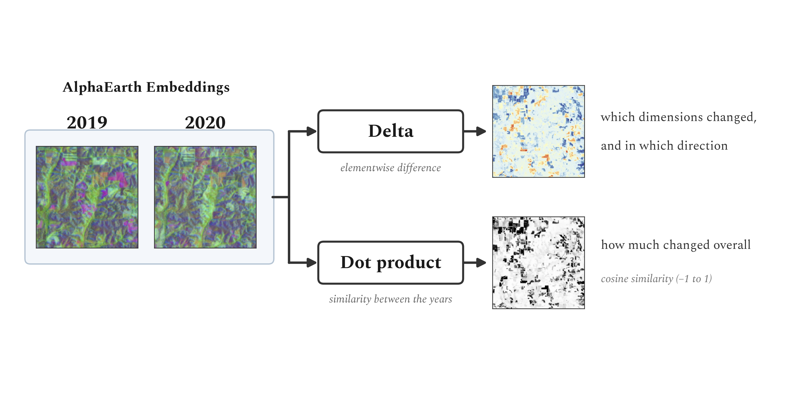

Version 3 — symbolic: the 2018 and 2020 embeddings as overlapping stacked squares, Delta as a
subtraction of two embeddings (square − square), and the dot product as a single dot:

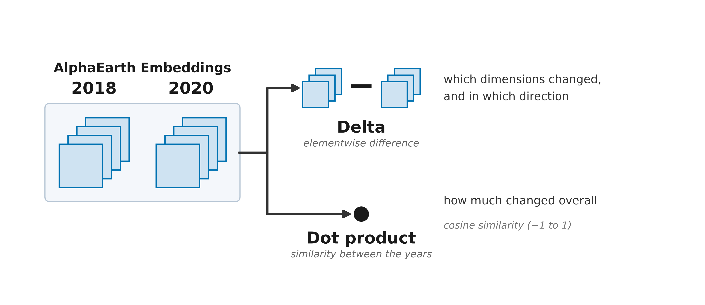

Version 4 — equations with abstract embedding textures: emb − emb = delta output (red-white-blue, still
64 dimensions, drawn as a stack); emb · emb = a single grayscale value:

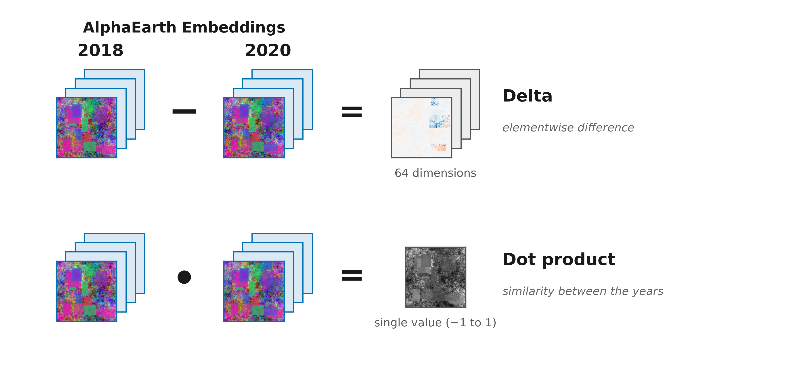

Version 5 — same as v4 but with smoother, more continuous embedding textures (like a true embedding):

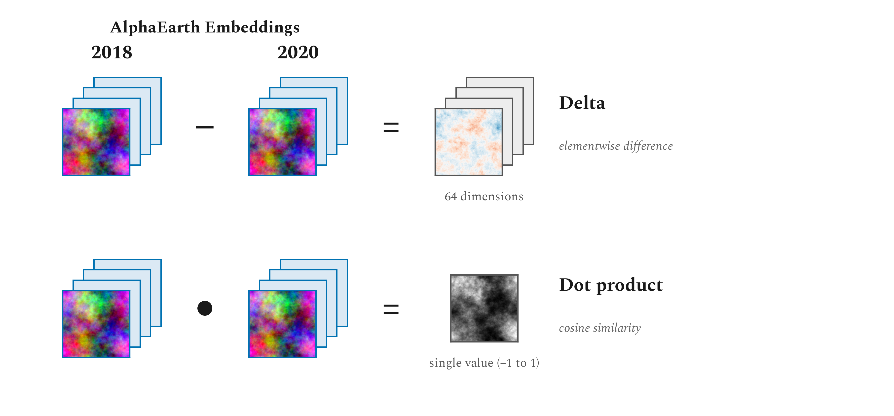

### Figure 16 — How the spectral composite baseline is built

Linear pipeline: three sensors, each a distinct color and showing its bands by type (Sentinel-2
Blue/Green/Red/NIR/SWIR; Landsat 8/9 adds Pan and Thermal; Sentinel-1 VV/VH/HH/HV/angle), feed one
spectral composite (50 bands with indices, growing season April to October), classified by a Random
Forest (300 trees) into a land-cover map. The growing-season window is user-supplied (not in the repo).

### Figure 18 — Change-agent F1 by model (five-class)

Transpose of Figure 14: grouped by change agent (Harvest, Development, Beaver, Insect/Disease), one bar
per model (v2 to v6 and the spectral baseline spec_all), colored by model. Same five-class per-class F1
on the common 168-cell set as Figure 14.

Version A, y auto-zoomed just above the tallest bar:

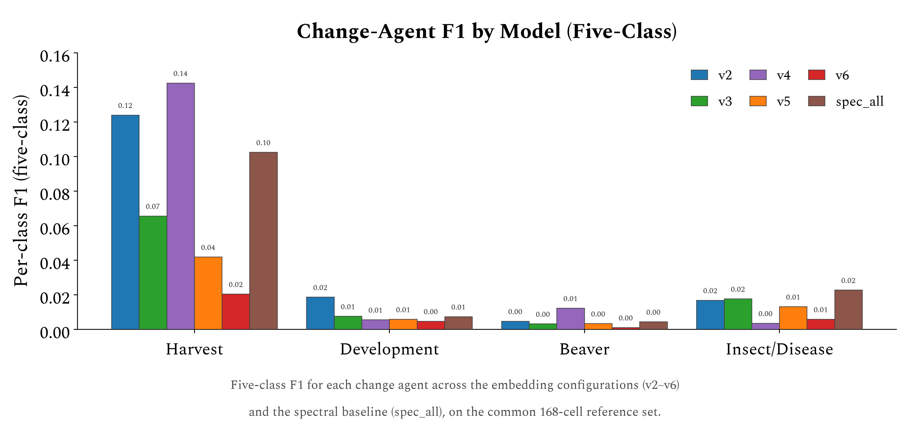

Version B, full 0–1 scale (drives the "all change F1 is at the floor" message):

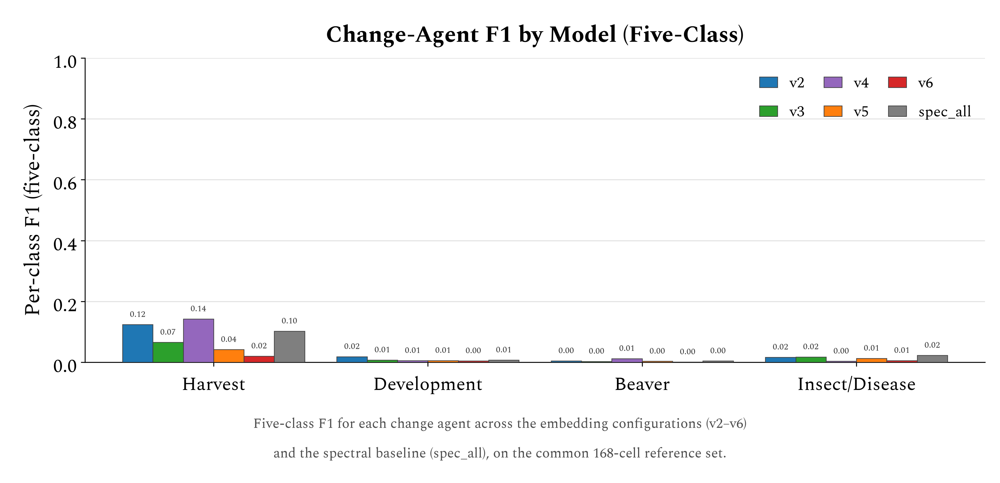

Version C, with the interpreter-agreement ceiling overlaid (dashed line + shaded 95% CI per agent):
every model sits well below the human ceiling.

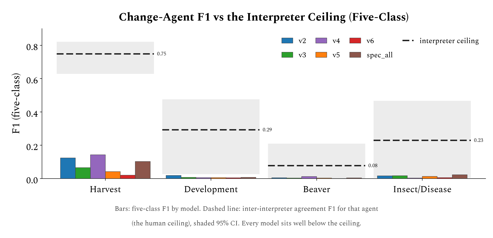

### Figure 19 — Interpreter-agreement ceiling (five-class)

Deck version of manuscript Figure 3.3: per-class inter-interpreter F1 with 95% CI on the 5-class
collapse, colored by reliability. This is the ceiling on any classifier's F1 (Stable and Harvest
reliable; Development, Insect/Disease, Beaver not):

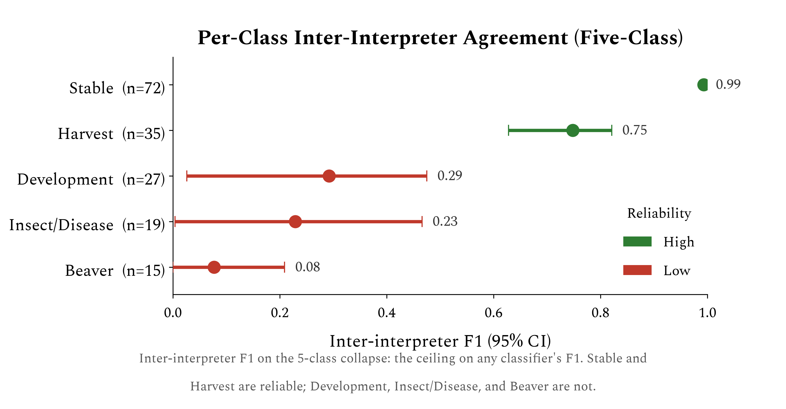

### Figure 17 — Accuracy metrics by model

Grouped bar chart of the 10-class headline metrics (OA, F1, IoU, Kappa; Table 2.3), grouped by statistic
and colored by model.

Version A, the five embedding models (v2 to v6):

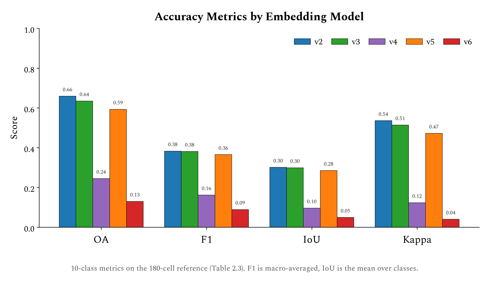

Version B, the same plus the spectral baseline (spec_all, grey; on the common 168-cell set):

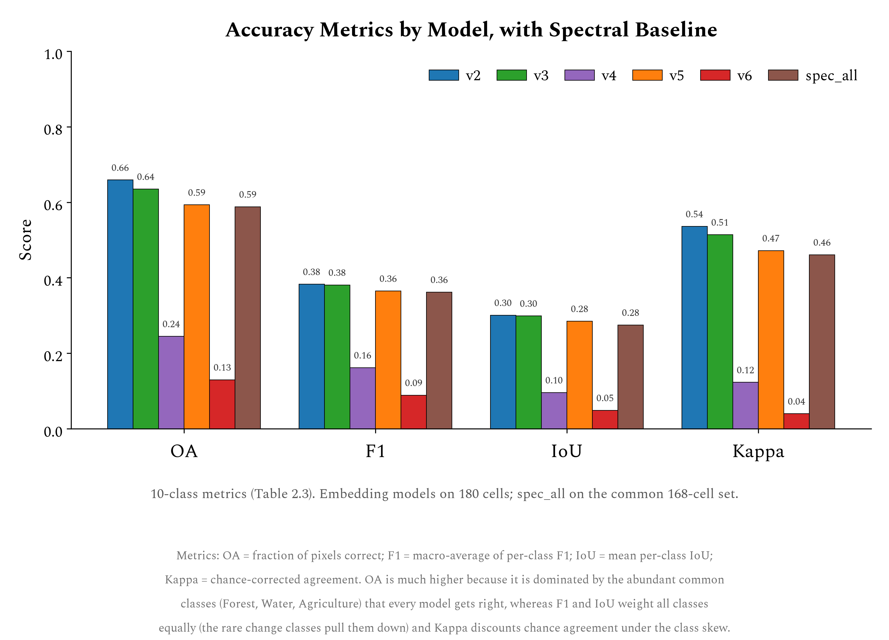

Five-class (collapsed) counterpart, same style, from Table T4 (all sources on the common 168-cell set;
OA is dominated by Stable, all-Stable baseline OA = 0.985). Embedding models only, then with spec_all:

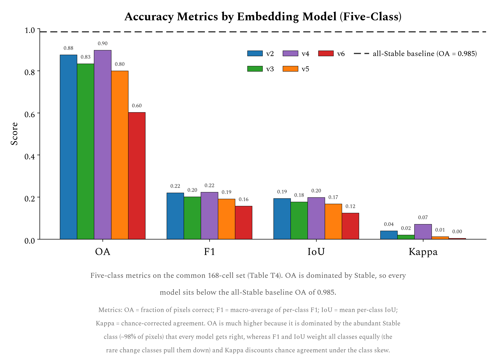

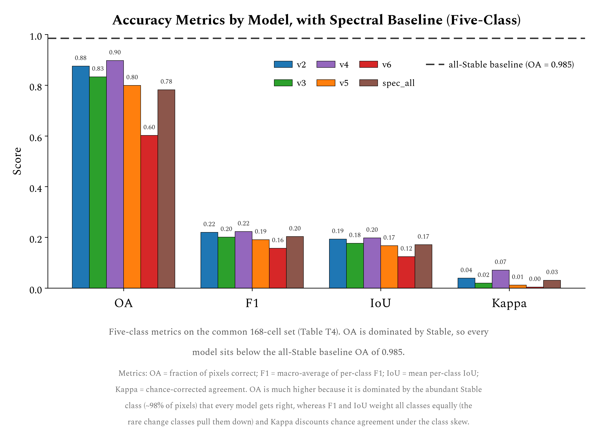

### AlphaEarth Foundations context panels

Two transparent 5.5 x 4.5 in slide panels (flat style matching the GFM band-stack reference), for the
AEF model slide. Spatial: each embedding reads its whole 1.28 km neighborhood, with one 10 m pixel
called out. Temporal: a simplified Figure 1B — irregular sensor observations in a "support period"
converge into one embedding, and a copper "valid period" bar is offset from it (the valid period need
not sit inside the support period). No month offset, no dimensionality, no user-chosen window.

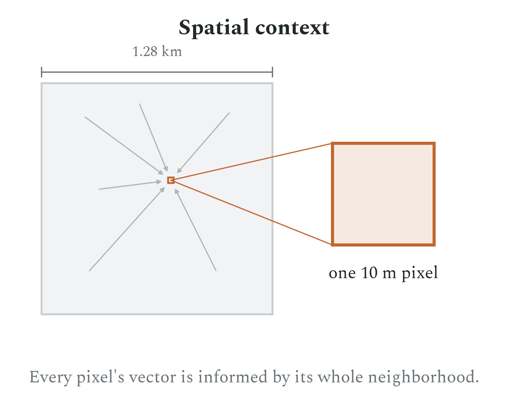
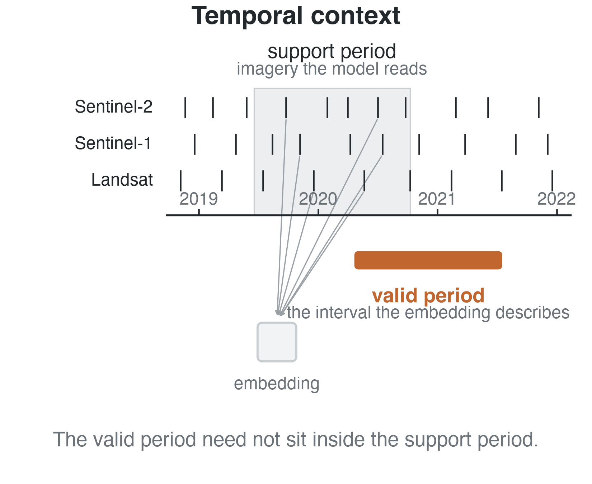

### 10-class legend

Standalone color-swatch legend for the 10 model classes (no title), grouped into the six no-change
classes and the four change classes. Colors are the canonical project legend (load_mappings), transparent
background for placing beside a classified map:

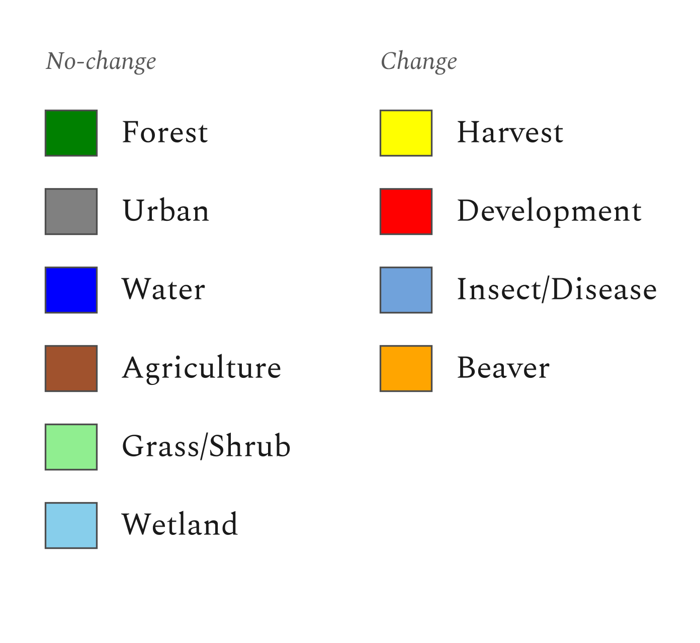

## Supplemental figures

### Supplemental — Tasseled Cap class-centroid trajectory

### Supplemental — Variant composition (embeddings + spectral), two options

Option A, compressed y-axis (clipped):

Option B, full continuous y-axis:

